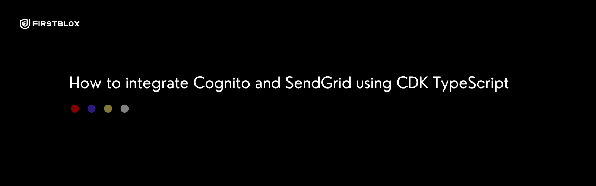
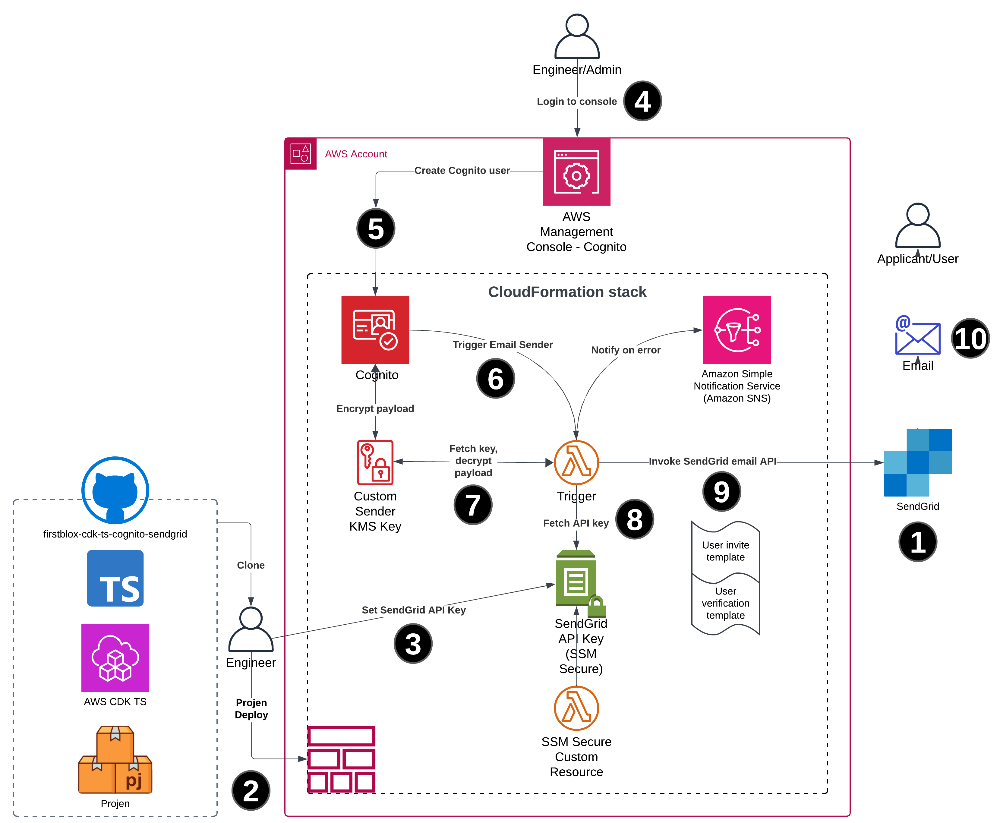

firstblox-cdk-ts-cognito-sendgrid
---------------------------------

# Table of Contents

[Overview](#overview)

[Architecture](#architecture)

[Deployment](#deployment)

# Overview

Utilise SendGrid as the email sender when using Cognito, developed using CDK TS.



This repository is the supporting code for this blog post [].

> [!IMPORTANT]
> This codebase is provided to showcase fuctionality and is NOT considered production ready.

> [!IMPORTANT]
> We recommend using this functionality in a codebase alongside a web application which has Cognito integration.

> [!IMPORTANT]
> We don't recommend inviting users via the Cognito console in a production context!

> [!IMPORTANT]
> Given this example codebase does not include a web application the password reset flow is only possible once functionality is integrated into a web application or via the CLI.

**Whats included?**

- Projen project scaffolding

- Sample Stack with:
  - Cognito User Pool.
  - Secure SSM Parameter for SendGrid API Key.
  - Cognito Lambda Trigger resource for SendGrid integration.
  - Lambda code to handle auth flows, email body generation from template, SendGrid integration.

**Pre-requisites**

- CDK CLI installed.
- Projen installed.
- AWS account CDK bootstrapped.
- Sufficient credentials to perform deployment from local.

# Architecture



1. SendGrid:
   * Sign-up/Login.
   * Generate API key.
   * Validate noreply email address under "Sender Authentication".
2. Projen deploy application from local.
3. Set secure SSM parameter with SendGrid API key.
4. Login to the AWS console and navigate to Cognito.
5. Cognito user invite:
   * Invite a user via their email address, ensure to select "Send an email invitation".
   * Mark email address as verified.
   * Select "Generated a password"
6. Cognito will automatically trigger the Custom Email Sender Cognito Lambda Trigger.
7. The Lambda Trigger will fetch the KMS encryption key, decrypt the paypload.
8. The Lambda Trigger will the fetch AWS SSM hosted SendGrid API key.
9. The Lambda Trigger will then generate an email body (dependent on flow) using an EJS template and send to SendGrid.
10. SendGrid will handle email. Visit the SendGrid dashboard to determine the delivery status of the email.

# Deployment

## Configure

In [main.ts](./src/main.ts) replace the following properties with your preferred email addresses:

- `noReplyEmailAddress`
- `errorNotificationEmail`

*See extract from main.ts below*

```typescript
new CognitoSendGridStack(app, 'firstblox-cdk-ts-cognito-sendgrid-dev', {
  env: devEnv,
  stage: DeploymentStage.DEV,
  applicationName: 'cognito-sendgrid-poc', // TODO: replace with your application name. Resources like SSM param names interpolate this.
  noReplyEmailAddress: process.env.NO_REPLY_EMAIL_ADDRESS || 'noreply@example.com', // TODO: Replace with a noreply email address validated in SendGrid.
  errorNotificationEmail:  process.env.ERROR_NOTIFICATION_EMAIL_ADDRESS || 'errors@example.com', // TODO: Replace with email address to receive failure events from Cognito Lambda trigger.
});

app.synth();
```

## Install

```bash
npx projen
```

## Deploy

Override default/dummy email addresses:

```bash
export NO_REPLY_EMAIL_ADDRESS='noreply@anotherexample.com'
export ERROR_NOTIFICATION_EMAIL_ADDRESS='errors@anotherexample.com'
```

```bash
npx projen deploy
```

## Destroy

```bash
npx projen destroy
```

